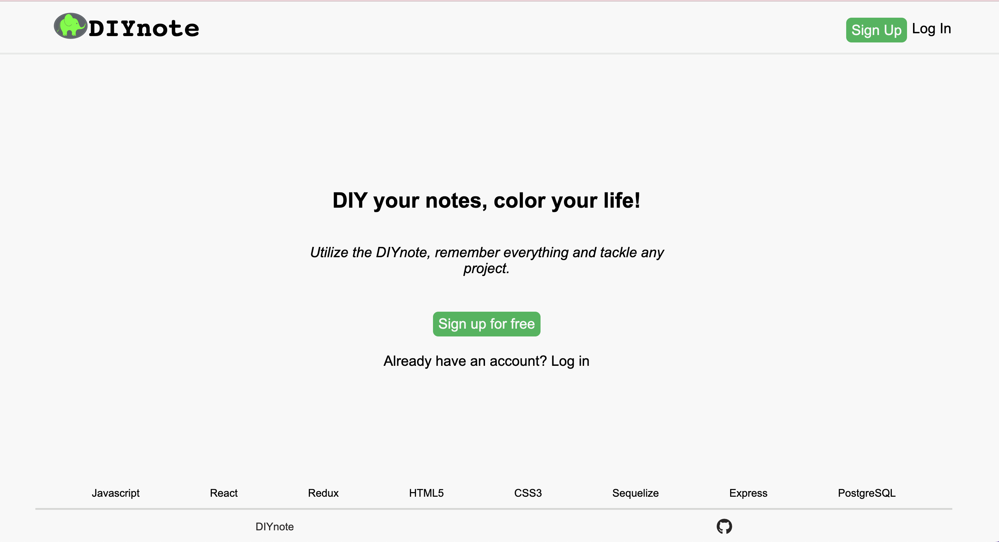
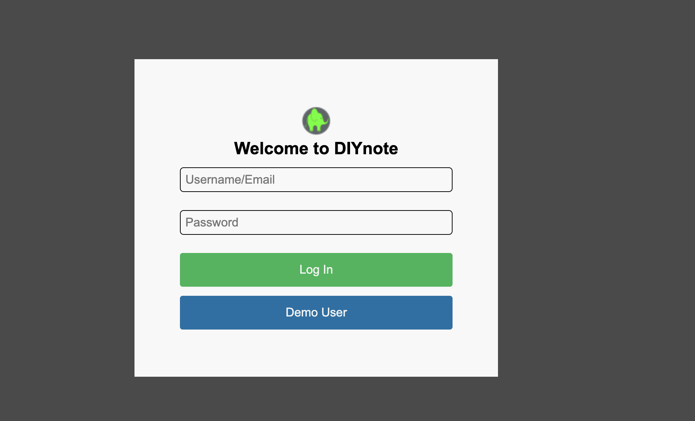
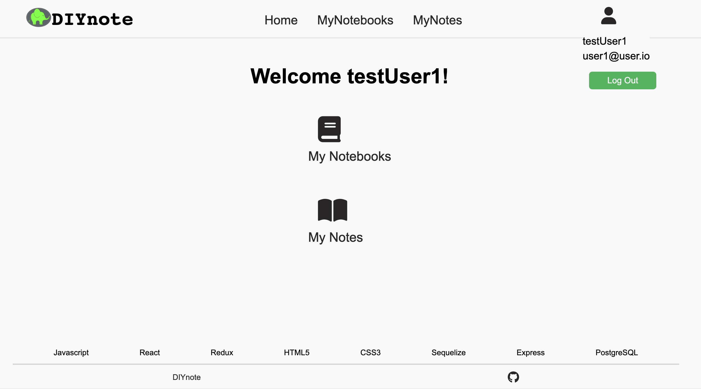
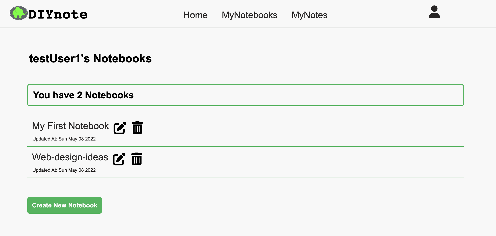
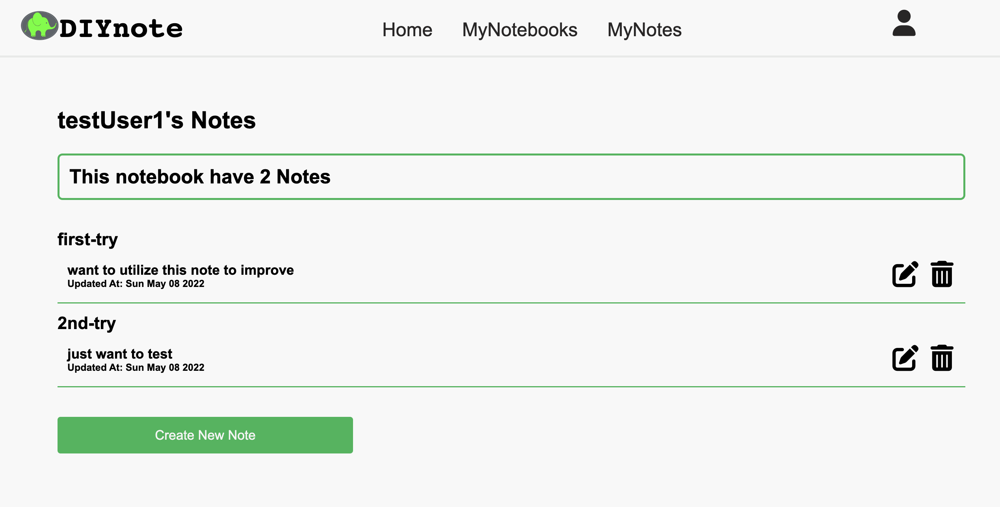
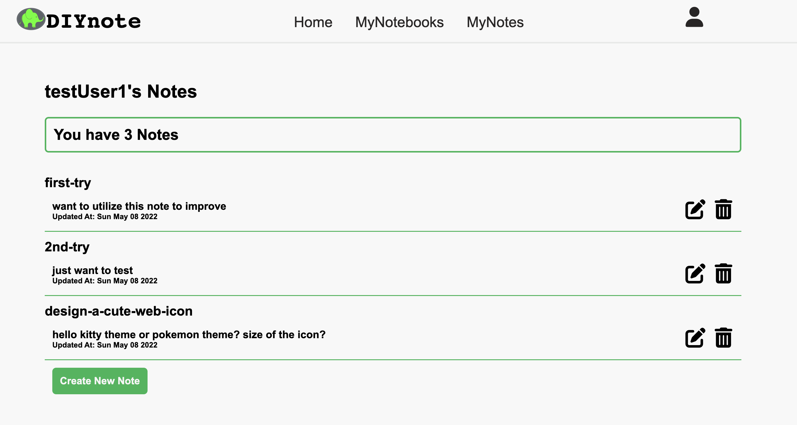
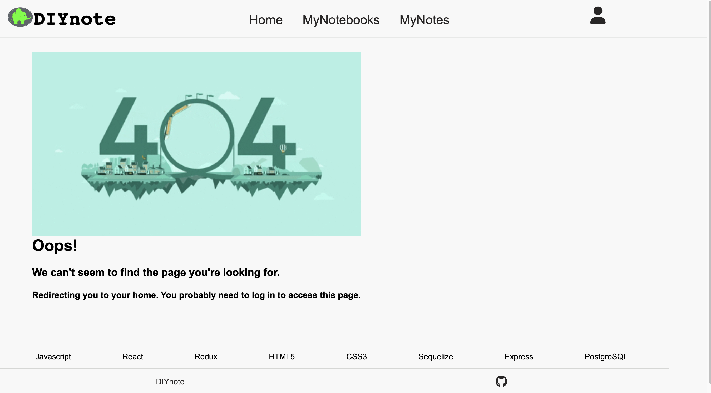

# DIYnote

DIYnote, an [Evernote](https://evernote.com/) clone, is a website where users can take notes and categorize notes by using notebooks. 

Welcome to check out a live version of DIYnote here: [diynote.com](https://diynote.herokuapp.com/)

- [Database Schema](https://github.com/yuefang323/DIYnote/wiki/Database-Schema)

- [MVP Feature List](https://github.com/yuefang323/DIYnote/wiki/MVP-Feature-List)

# Technologies Used
## Frontend


## Backend


# Getting started
1. Clone this repository

   ```git clone git@github.com:yuefang323/solo-project.git```

2. CD into the backend directory and install dependencies

   ```npm install```
    
3. CD into the frontend directory and install dependencies

   ```npm install```
    
4. Create a .env file based on the .env.example given

6. Create a user in psql based on your .env DB_USERNAME

   ```psql -c "CREATE USER <username> PASSWORD '<password>' CREATEDB"```
  
6. Create the database, migrate, and seed
  
   ```npx dotenv sequelize db:create```
   
   ```npx dotenv sequelize db:migrate```
   
   ```npx dotenv sequelize db:seed:all```
   
7. Open up two terminals and cd into the backend and frontend directories, respectively. Start the server in each by running:

   ```npm start```

# Features
## Splash Page & User Authentication
A user can sign up or log in with an existing account in this page. Alternatively, a user can explore the web as a Demo user. 




## User Home Page
Once a user logged in, he can see two links on the home page main body. One is linked to all his notebooks and the other is linked to all his notes. On the navigation bar, 3 links allow a user to swith the view page among home, notebooks and notes pages. The profile icon shows the user's information. It also has a logout button which allows a user to log out. 



## User Notebooks Page
A user can read all his notebooks on this page. He can also create, update and delete a specific notebook here. Once he deleted a notebook, all notes included in that notebook would also be deleted. Once he clicked the notebook link, he is able to see all notes in that notebook. Then, he can create, edit and delete a specific note there. 




## User Notes Page
A user can read all his notes on this page. He can also create, update and delete a specific note on this page. In particular, if he does not want to put a note in a notebook, he can manage that note on this page. 



## 404 Error Page 
If a user unaccidently accesses a path that is not exist or cannot be accessed because he is not a login user, the 404 Error Page will be rendered. It will automatically redirect the user to the previous page or login page. 



# Upcoming Features
- A user friendly home page. 
- Notebook: a user can freely move notes between different notebooks. 
- Tags: CURDs of a tag feature. 
